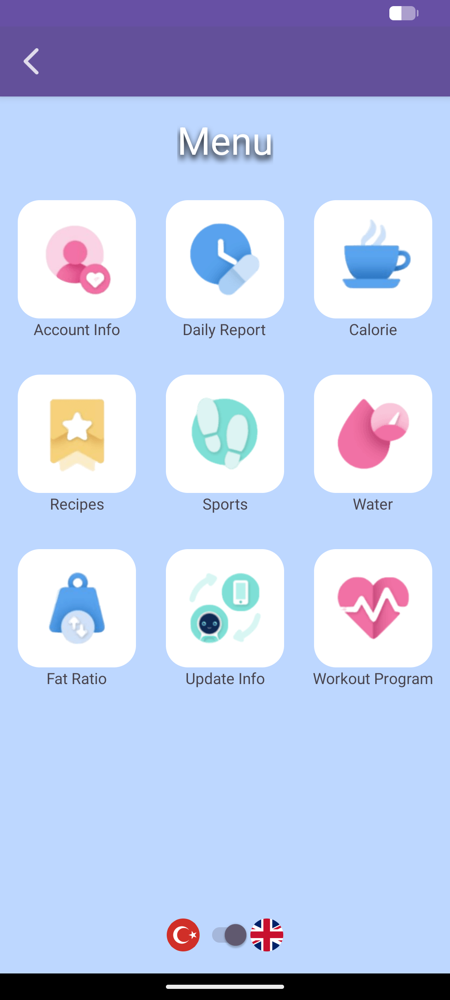
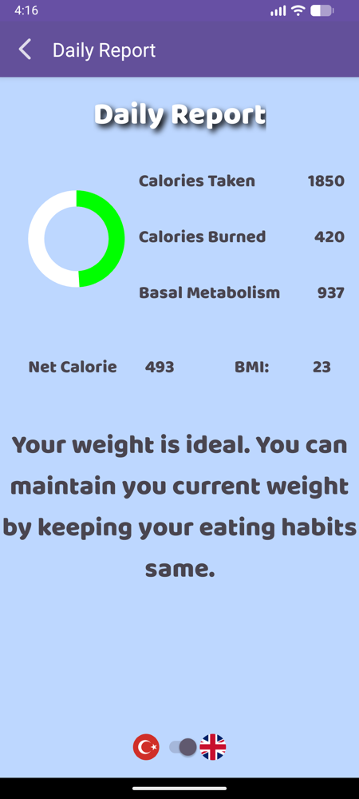
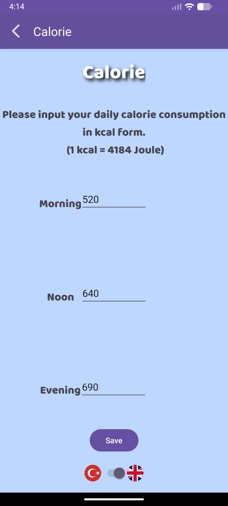
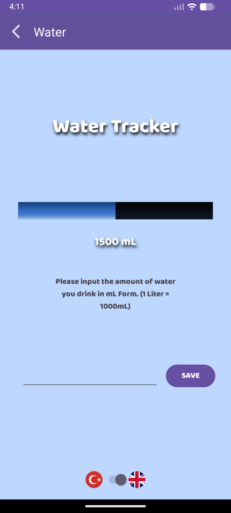
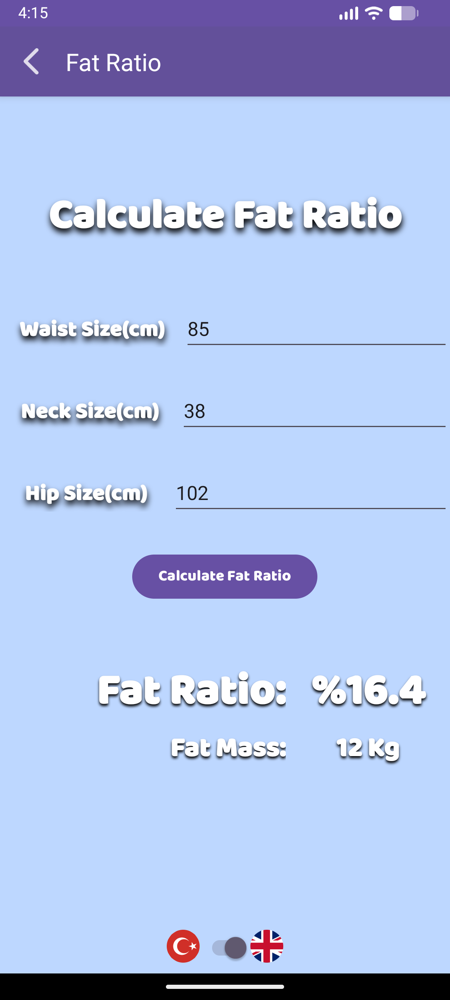
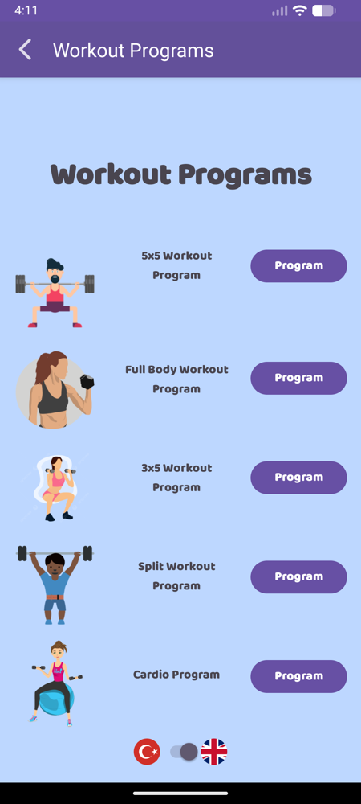
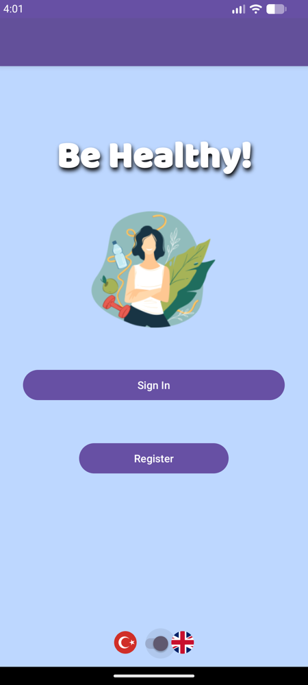
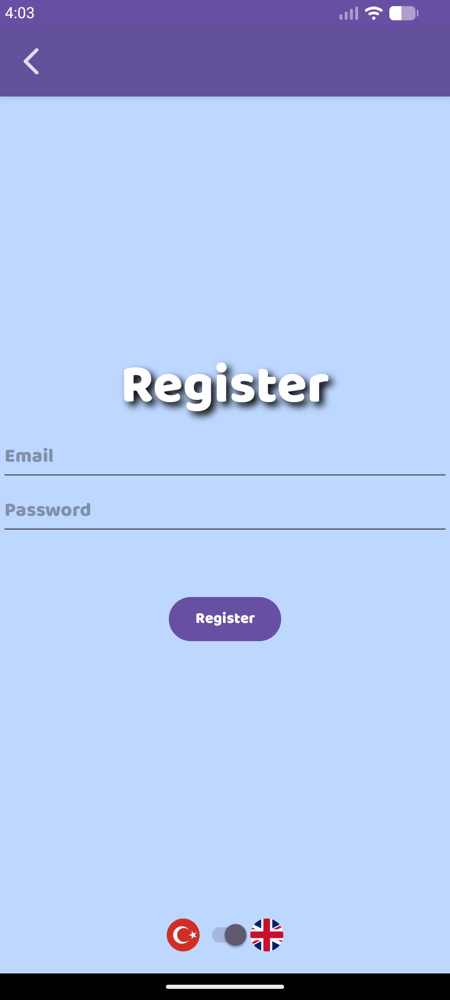

# BeHealthy

An Android application (Java) for logging daily calorie intake, exercise and water consumption against a stored user profile, with BMI, basal-metabolism and body-fat calculations and a bilingual Turkish/English interface.

## Overview

BeHealthy is a native Android app built in **June 2023**. It is kept here as an example of earlier Android application development work; it is not actively maintained and was never published to an app store.

The app is organised as 17 activities. A user registers with an email and password through Firebase Authentication, enters a profile (name, age, weight, height, sex) that is stored in the Firebase Realtime Database, and then reaches a menu of nine screens. Daily entries — calories eaten, calories burned through exercise, and water drunk — are written to a date-keyed node under the user's record, and a summary screen reads them back together with values derived from the profile.

Every screen carries a Turkish/English toggle, so the entire interface can be switched between the two languages at runtime.

## Features

All of the following were verified against the source in this repository.

| Feature | Implementation |
|---|---|
| Email/password registration and sign-in | `register.java`, `logIn.java` — Firebase Authentication |
| Profile capture and update | `Register2.java`, `UpdateInfo.java` — writes `Users/{uid}` in the Realtime Database |
| Account overview | `Account.java` — profile fields plus BMI and its band |
| Calorie intake logging | `Calorie.java` — separate morning/noon/evening inputs, summed per day |
| Exercise logging | `Sports.java` — seven activities selected from a spinner, multiplied by duration in minutes |
| Water logging | `Water.java` — millilitre entries accumulated against a fixed 3000 mL bar |
| Daily summary | `DailyReport.java` — intake, expenditure, basal metabolism, net calories, BMI, and a fixed advisory string chosen by BMI band |
| Body-fat calculator | `MuscleAndFat.java` — circumference-based estimate and resulting fat mass |
| Recipe list | `Recipe.java` — six fixed entries, each opening an external page in an in-app WebView |
| Workout program list | `Workout.java` — five fixed entries, each opening an external page in an in-app WebView |
| Turkish/English interface | Every activity — a `Switch` whose state is passed between screens as an intent extra |

The recipe and workout screens are catalogues of fixed external links. They are the same for every user and do not adapt to the profile.

## Application architecture

```
17 Activities  (ConstraintLayout / LinearLayout XML)
      │
      │  intent extras carry only the language flag ("sw")
      ▼
UserInfo       single model class; all fields are static, so loaded
      │        values are visible to every activity
      ▼
FirebaseAuth                 FirebaseDatabase (Realtime Database)
  identity                     Users/{uid}             → name, sex, years, weight, height
                               Users/{uid}/{DDMMYYYY}  → takenCal, burnedCal, water
```

`menu.java` attaches two `ValueEventListener`s — one for the profile node, one for today's date node — and populates the static fields on `UserInfo`. Other screens construct a `UserInfo` and read those fields. There is no local database, no fragments, and no ViewModel or LiveData; the architecture is plain activities over the Firebase SDKs.

## Technical highlights

- **Date-keyed daily records.** Each day's totals live under a `DDMMYYYY` child of the user's node (`Users/{uid}/8092025`), so history accumulates day by day without a schema change. The date key is built from `Calendar` fields at write time in `Calorie.java`, `Sports.java` and `Water.java`.
- **Signed net-calorie bar.** `DailyReport.java` renders calorie surplus and deficit on one bar: when the net value is negative it swaps in an alternate drawable and sets `setScaleX(-1)`, so the bar fills in the opposite direction from the same widget.
- **Runtime language switching without locale resources.** Rather than using Android's locale qualifiers, each string exists as a `_T`/`_E` pair in `turkish.xml`, and a `Switch` on every screen re-assigns the text of each view. The switch state travels between activities as a boolean intent extra so the chosen language survives navigation.
- **Firebase Authentication and Realtime Database integration** written directly against the SDKs, including asynchronous listener callbacks and per-user data scoping by UID.
- **Three anthropometric formulas** implemented from scratch, including logarithmic terms in the body-fat estimate.

## Screens

Unmodified screenshots of the app running on an Android emulator (API 36), built from this repository. The profile and daily figures are synthetic demo values entered locally — no real person's data, and no live Firebase account or database was used to produce them. The TR/EN toggle visible at the bottom of every screen is the language switch.

| Main menu | Daily report | Calorie logging |
|:---:|:---:|:---:|
|  |  |  |
| Nine-tile hub | Intake, expenditure, basal metabolism, net calories and BMI | Separate morning / noon / evening entries |

| Water tracker | Body-fat calculator | Workout programs |
|:---:|:---:|:---:|
|  |  |  |
| Progress against a fixed 3000 mL bar | Navy formula computed from waist, neck and hip input | Five programs, each opening a page in a WebView |

The daily report above is the calculation chain end to end: 520 + 640 + 690 kcal logged, 420 kcal of exercise, a basal metabolism of 937 kcal derived from the demo profile, and the resulting net of 493 kcal drawn on the signed progress bar.

<details>
<summary>Before sign-in</summary>

| Welcome | Register |
|:---:|:---:|
|  |  |

</details>

## Calculations

The app implements the following published formulas. They are described here as software, not as health guidance.

**Body mass index** — `UserInfo.bmiCalculate()`

```
BMI = weight_kg / (height_m)²
```

Classified in `UserInfo.bmiRate()` using the thresholds ≤18, ≤25, ≤35 and above, labelled Underweight / Normal Weight / Overweight / Obesity. These cut-offs are the ones written into the source and differ from the WHO categories (18.5 / 25 / 30).

**Basal metabolic rate** — `UserInfo.getBasalMetabolism()`

A Harris–Benedict variant. See [Known implementation limitations](#known-implementation-limitations) for two defects in this method.

```
66.5 + (13.7 × weight_kg) + (5 × height_cm) − (6.7 × age)   // intended for "men"
66.5 + (9.6 × weight_kg) + (1.8 × height_cm) − (4.7 × age)  // otherwise
```

**Body fat percentage** — `MuscleAndFat.java`

The U.S. Navy circumference method, using waist, neck and (for the second branch) hip measurements in centimetres:

```
Men:   495 / (1.0324 − 0.19077·log₁₀(waist − neck) + 0.15456·log₁₀(height)) − 450
Women: 495 / (1.29579 − 0.35004·log₁₀(waist + hip − neck) + 0.22100·log₁₀(height)) − 450

Fat mass = weight_kg × body_fat_% / 100
```

**Exercise energy expenditure** — `Sports.java`

A flat lookup table of kcal per minute, not adjusted for body weight or intensity:

| Activity | kcal/min |
|---|---|
| Walking | 5 |
| Jogging | 15 |
| Cycling | 12 |
| Swimming | 12 |
| Basketball | 10 |
| Jump rope | 13 |
| Gymnastics | 5 |

**Net calories** — `DailyReport.java`

```
net = calories_taken − (calories_burned + basal_metabolism)
```

> **This is not medical software.** BeHealthy is a student-level programming project. It is not a medical device, has not been clinically validated, and does not provide medical, nutritional or diagnostic advice. The formulas above are standard published equations implemented as a programming exercise, and the app's on-screen messages are fixed strings selected by BMI band, not individualised guidance. Do not use it to make health decisions.

## Project structure

```
app/src/main/
├── AndroidManifest.xml
├── google-services.json          historical Firebase config (see Getting started)
├── java/com/example/cilek_adam/
│   ├── MainActivity.java         language toggle, entry point
│   ├── logIn.java  register.java  Register2.java   authentication and profile capture
│   ├── menu.java                 nine-tile hub; loads profile and daily totals
│   ├── UserInfo.java             model + BMI/BMR calculations (static fields)
│   ├── Calorie.java  Sports.java  Water.java       daily logging
│   ├── DailyReport.java          daily summary and net-calorie bar
│   ├── MuscleAndFat.java         body-fat calculator
│   ├── Account.java  UpdateInfo.java               profile view and edit
│   ├── Recipe.java  Workout.java                   fixed external link catalogues
│   └── Web.java  WebWorkout.java                   WebView hosts
└── res/
    ├── layout/                   17 activity layouts
    ├── values/turkish.xml        paired _T / _E strings for both languages
    ├── values/colors.xml  themes.xml
    ├── drawable/                 recipe images, progress-bar drawables
    └── mipmap-*/                 launcher and in-app icons
docs/screenshots/                 emulator screenshots used in this README
```

## Getting started

**Requirements**

- Android Studio, or a command-line Android SDK
- **JDK 17.** The project uses Gradle 7.5 and Android Gradle Plugin 7.4.2, which do not run on JDK 21 or later.
- Android SDK platform 33 (`compileSdk`/`targetSdk`); minimum supported device API is 24

**You must supply your own Firebase project.** The `google-services.json` committed here belongs to the original 2023 project and has no `firebase_url` entry, so `FirebaseDatabase.getInstance()` cannot resolve a database and the app will fail after sign-in. It is kept only as part of the historical project. To run the app:

1. Create a Firebase project and register an Android app with the package name `com.example.cilek_adam`.
2. Enable **Email/Password** under Authentication, and create a **Realtime Database**.
3. Download your own `google-services.json` and replace `app/google-services.json`.
4. Build and run:

```bash
JAVA_HOME=/path/to/jdk-17 ./gradlew assembleDebug
```

The app writes each user's profile and daily totals under `Users/{uid}`, so set your database rules to allow a signed-in user access only to their own subtree.

## Technologies

- Java 8 (source and target compatibility)
- Android SDK 33, minimum API 24
- Gradle 7.5, Android Gradle Plugin 7.4.2
- AndroidX AppCompat 1.6.1, ConstraintLayout 2.1.4, Legacy Support v4 1.0.0
- Material Components 1.9.0
- Firebase Authentication 22.0.0, Firebase Realtime Database 20.2.1
- Android WebView
- Downloadable Fonts via Google Play Services (Baloo)

## Known implementation limitations

Documented rather than fixed, so the project stays as it was written in 2023.

**Calculations**

- In `UserInfo.getBasalMetabolism()`, the sex is compared against the lowercase string `"men"`, but `Register2.java` stores `"Men"`. The first branch is therefore unreachable and every user is evaluated by the second one.
- That second branch combines the female Harris–Benedict coefficients with the male constant 66.5; the standard female equation uses 655.1. Reported basal metabolism is correspondingly low.
- BMI thresholds differ from the WHO categories, as noted above.
- Exercise energy is a fixed kcal-per-minute constant per activity, independent of body weight.

**Application**

- Shared state lives in static fields on `UserInfo`, so it is process-global and lost when the process is killed. There is no `ViewModel`, no saved instance state, and no offline persistence.
- `menu.java` starts two asynchronous database listeners without ordering them; whether the daily totals are already loaded when the profile listener runs is a race.
- Numeric input is parsed with `Integer.parseInt` / `Double.parseDouble` and no validation, so empty or non-numeric entries throw and close the screen.
- Each save writes the whole day node with `setValue`, overwriting fields rather than updating them.
- The language switch is re-implemented in every activity rather than using Android's locale resource qualifiers, which accounts for a large share of the code.
- Only the generated `ExampleUnitTest` and `ExampleInstrumentedTest` stubs exist; there are no real tests.
- The package name and project name are still the Android Studio defaults from development (`com.example.cilek_adam`, `Cilek_Adam`).
- The recipe and workout screens depend on third-party websites that may move or disappear.

## Assets

The six recipe photographs bundled under `app/src/main/res/drawable/` were added during the original 2023 development and their source and licensing are not documented in this repository. They correspond to the external recipe pages the app links to and may not be freely redistributable. For this reason no repository-wide licence is offered here, and the code should not be assumed to carry redistribution rights over those images.

The Baloo typeface is loaded at runtime through Google Play Services Downloadable Fonts and is not bundled.

## Background

BeHealthy was written in June 2023 as a personal Android project, in Turkish and English. It is retained as an example of application development work — multi-screen Android navigation, third-party authentication, a cloud database schema, and formula implementation — and is not under active development. The code has been left as it was written; this repository has only had its documentation rewritten, unused image assets and IDE metadata removed, and the missing Unix Gradle wrapper script added.
